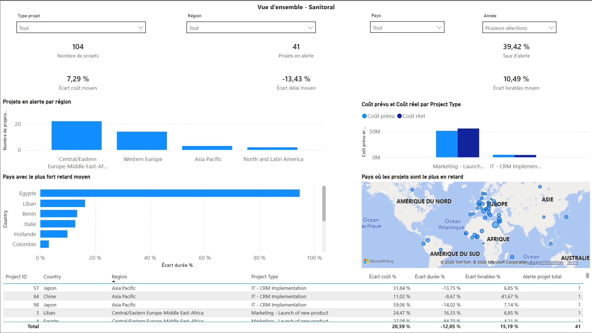
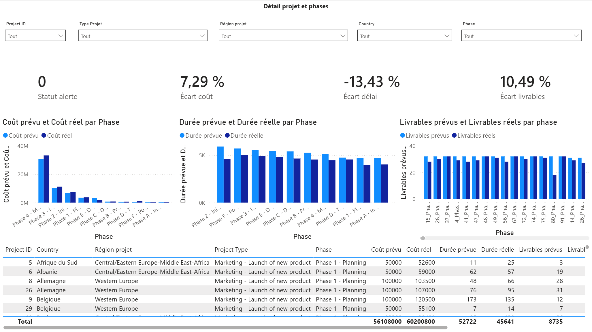
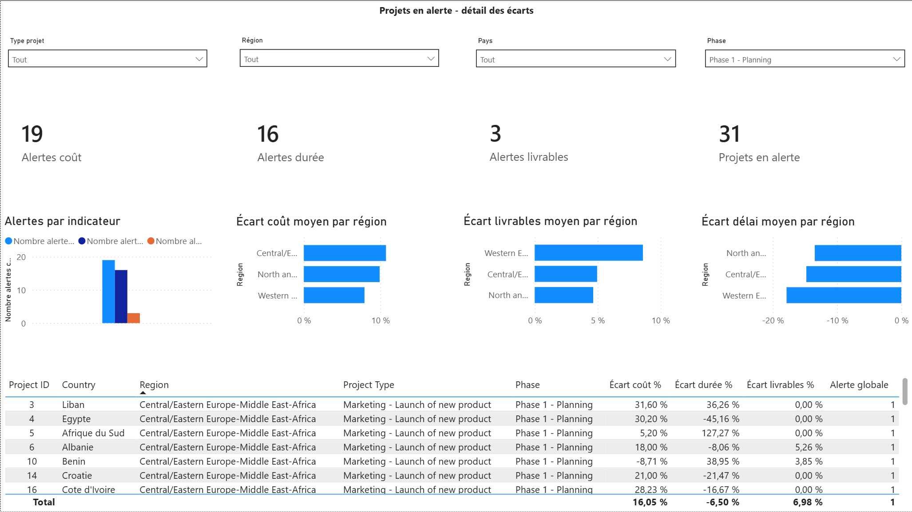

# Tableau de bord de suivi de projets avec Power BI

Projet de Business Intelligence réalisé dans le cadre de ma formation Data Analyst chez OpenClassrooms.

L’objectif est de permettre le suivi d’un portefeuille de projets et d’identifier rapidement les écarts de coûts, de délais et de livrables.

## Objectifs du projet

- Suivre le nombre total de projets
- Identifier les projets présentant une alerte
- Comparer les valeurs prévues et réelles
- Mesurer les écarts de coûts, de délais et de livrables
- Analyser les résultats par région, pays, type de projet et phase
- Faciliter l’identification des projets nécessitant une action prioritaire

## Technologies utilisées

- Power BI
- Power Query
- DAX
- Modélisation de données
- Data visualisation

## Pages du tableau de bord

### Vue d’ensemble

Cette page présente les principaux indicateurs du portefeuille :

- nombre total de projets ;
- nombre et taux de projets en alerte ;
- écarts moyens de coûts, de délais et de livrables ;
- répartition des alertes par région ;
- pays présentant les retards moyens les plus importants ;
- comparaison des coûts prévus et réels.

### Détail des projets et des phases

Cette page permet de comparer les valeurs prévues et réelles pour chaque projet et chaque phase :

- coûts ;
- durées ;
- livrables ;
- statut d’alerte.

### Projets en alerte

Cette page est consacrée aux projets présentant au moins un écart nécessitant une attention particulière.

Elle permet de suivre :

- les alertes de coûts ;
- les alertes de durées ;
- les alertes de livrables ;
- les écarts moyens par région ;
- le détail des projets concernés.

## Fonctionnalités

- Filtres interactifs par projet, région, pays, phase et année
- Navigation entre plusieurs pages d’analyse
- Indicateurs calculés avec DAX
- Comparaison entre valeurs prévues et réelles
- Système d’alerte pour identifier les projets en difficulté
- Tableau détaillé permettant d’approfondir l’analyse

## Principaux indicateurs

Le tableau de bord utilise notamment :

- nombre de projets ;
- nombre de projets en alerte ;
- taux d’alerte ;
- écart de coût en pourcentage ;
- écart de durée en pourcentage ;
- écart de livrables en pourcentage ;
- alerte globale du projet.

## Compétences mises en œuvre

- Préparation et transformation de données avec Power Query
- Création de mesures DAX
- Conception d’indicateurs de performance
- Mise en place de règles d’alerte
- Création de visualisations interactives
- Organisation d’un tableau de bord en plusieurs niveaux d’analyse
- Présentation d’informations à un public non technique

## Données

Les données sources et le fichier Power BI ne sont pas publiés dans ce dépôt.

Le dépôt présente la démarche, les principales fonctionnalités et des captures du tableau de bord.

## Auteur

**Tom Soler**  
Étudiant Data Analyst

- [LinkedIn](https://www.linkedin.com/in/tom-soler-a18377268)
- [GitHub](https://github.com/tomsoler-data)
